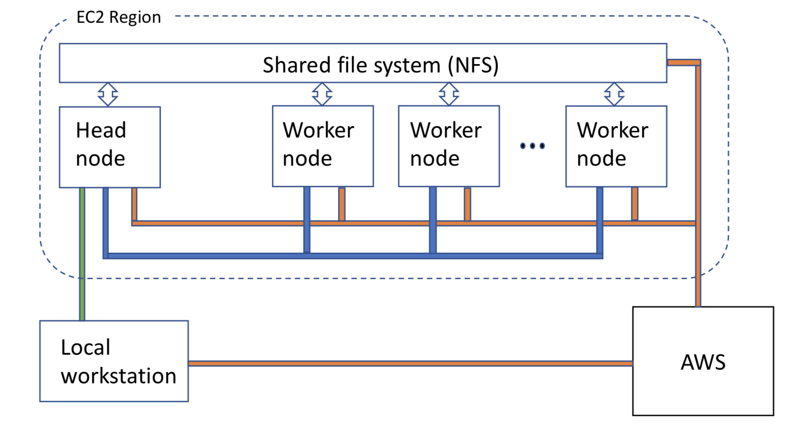
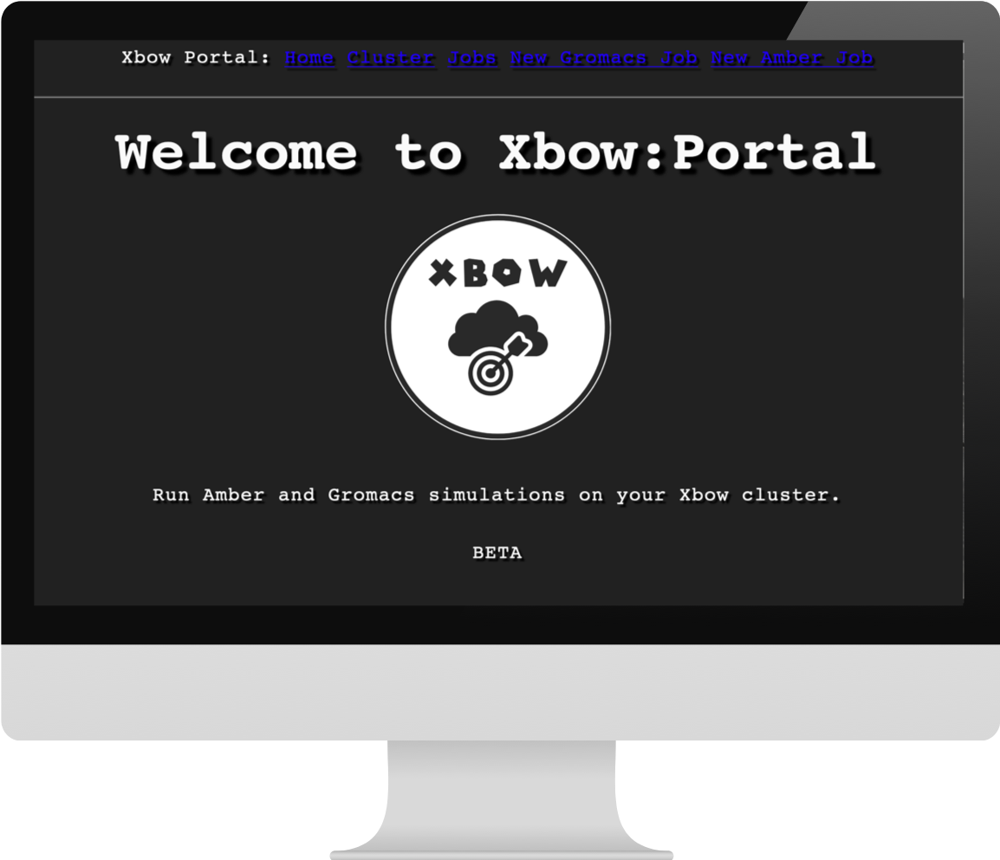

Project-Xbow
============

**Xbow** allows you to create your own custom compute cluster in the cloud. The cluster has a "head' node that you communicate with and can log in to, a number of 'worker' nodes to run your jobs, and a shared file system that links them all together.

Currently **Xbow** focusses on supporting the Biomolecular Simulation community, but is potentially useful in any field.

Currently **Xbow** runs only on Amazon Web Services (AWS), and you must have an AWS account set up before you can use **Xbow**.

Before using **Xbow**, you must configure your AWS environment. Follow the instructions `here <https://docs.aws.amazon.com/cli/latest/userguide/cli-chap-getting-started.html>`_ to do that. Once you have reached the point where you have a ``$HOME/.aws`` folder containing a ``config`` and ``credentials`` file you are ready to use **Xbow**!

Getting and Installing **Xbow**
~~~~~~~~~~~~~~~~~~~~~~~~~~~~~~~~

The recommended method to install **Xbow** is using pip::

    pip install xbow

Using **Xbow** and Building your Lab
~~~~~~~~~~~~~~~~~~~~~~~~~~~~~~~~~~~~~~~~

In order to boot a **Xbow** Cluster run the command::

    xbow lab

If this is the first time you have run **Xbow** then it will first configure **Xbow** and get everything ready to build your lab. 
This command creates a directory ``$HOME/.xbow`` containing a number of files, including ``settings.yml`` which you can edit at any time in the future to adjust the make-up of your **Xbow** cluster. See the section **Xbow** settings file for more info on this. As part of the configuration step the ``xbow lab`` command will create a shared filesystem in the 'cloud' which will be attached
to every cloud resource you boot up. It also creates temporary credential files which allow you to login to your resources.
After all these checks have been done it creates a head node ready for you to use your lab.

Using **Xbow:Lab**
~~~~~~~~~~~~~~~~~~~~~~~~~~~

There are several ways to use your **Xbow:Lab** which have been designed to accomadate most users needs:

- **Xbow:Portal**. A Browser based GUI that allows you to submit your jobs to your **Xbow:Lab**
- **Xbow:Note**. A Jupyter Notebook running on your **Xbow:Lab**
- **Xbow:Flow**. A tool to allow you to run your jobs that makes use of the workflow language **xbowflow**. Can be run on your local workstation or remotely using **Xbow:Login**  
- **Xbow:Login**. A simple way to login to your **Xbow:Lab** and run your jobs using **Xbow:Flow**

**Xbow:Portal**
~~~~~~~~~~~~~~~~~

**Xbow:Portal** creates a browser based GUI. To start this::

    xbow portal

**Xbow:Note**
~~~~~~~~~~~~~~~~~

**Xbow:Flow**
~~~~~~~~~~~~~~~~

**Xbow** has been designed to require you to make minimal changes to the way you are used to running jobs on your local machine. Running jobs using **Xbow** can be as simple as the following example::

If your local job runs like this::

    executable -a arg1 -b arg2 -c arg3

Simply change it to::

    xbow flow executable -a arg1 -b arg2 -c arg3

This will:

- Boot a worker/workers
- Transfer your data to your **Xbow:Lab**
- Run your simulation
- Shut your worker/workers down
- Bring your data back to your local resource (if you want it to!)

By default the command ``xbow flow`` will use the specifications in the ``~/.xbow/settings.yml`` file. These can be overridden by adding the flags:

-c   type of compute resource
-n   number of workers

**Xbow:Login**
~~~~~~~~~~~~~~~~~~

Using **Xbow:Lab** can be done entirely remotely but if you prefer to work directly on the head node this is possible with the command::

    xbow login

All your jobs can be run using the same commands from **Xbow:Flow**. As you are on the head node it is assumed all your data is already here so no data staging is done.

This will tell you if your job is still running or if it is finished. If it has finished it will copy all your data back to your local machine and delete it from the cloud. 

Creating an **Xbow** Cluster
~~~~~~~~~~~~~~~~~~~~~~~~~~~~

To create a new **Xbow** cluster, run the command::

    xbow-create_cluster

This command will create the head node, worker nodes, and shared file system according to the specification in your ``settings.yml`` file.

Launching Xbow:Portal
~~~~~~~~~~~~~~~~~~~~~

To launch Xbow:Portal, run the command::

    xbow-portal

This will start configuring the Xbow:Portal. Copy the URL from the terminal to your browser, and you can start using the GUI to run Amber and Gromacs simulations on your Xbow cluster. On Xbow:Portal you can also monitor the progress of your jobs, view and download output files, or check your cluster status.

    
Logging in to the head node
~~~~~~~~~~~~~~~~~~~~~~~~~~~

For simple jobs you may never need to log into the **xbow** cluster at all. But if you want to log in to the head node you can using the command::

    xbow-login

From here you can run more complex jobs and workflows using the **Xflow** tool. See `here <https://github.com/ChrisSuess/Project-Xbow/wiki/An-Introduction-to-Xbowflow-Workflows>`_ for details.

Transferring Data to and from your **Xbow** Cluster
~~~~~~~~~~~~~~~~~~~~~~~~~~~~~~~~~~~~~~~~~~

If you choose to use **Xbow** outside the **xbow-sync** command, you take responsibility for transferring ("staging") data
between your local machine and the cluster. Typically, you first create a folder on your local workstation in which you place 
all required input files for your simulation. You then copy the whole folder to the shared filesystem on the **Xbow** cluster,
log in to the cluster and run the job, and when it has finished copy all the results files back to your local machine.

To **Sync** data between your machine and your **Xbow** cluster use the command::

    xbow-sync

Deleting Your **Xbow** Cluster
~~~~~~~~~~~~~~~~~~~~~~~~~~~~~~

Remember that, as a cloud resource, you are paying for your **Xbow** cluster whether you are using it or not, so once your jobs are finished, you should delete it. Deleting the cluster does NOT delete the shared file system though, so at any time you can create a new **Xbow** cluster and your data will still be there (unless it has alreday been copied back by an **xbow-check** command). 

To delete the entire cluster::

    xbow-delete_cluster

To delete the workers and keep the head node alive use the command::

    xbow-delete_workers

Running an Example **Xbow** Job
~~~~~~~~~~~~~~~~~~~~~~~~~~~~~~~

1. Obtain the example files
---------------------------
Download the examples tarball::

    curl https://raw.githubusercontent.com/ChrisSuess/Project-Xbow/devel/xbowflow/examples.tgz -o examples.tgz

Then uncompress this::

    tar -zxvf examples.tgz

This should create a new folder called *examples*. For this example we are going to use the files in the folder
*SimpleJobs/Gromacs* which will run a short MD simulation of BPTI::

    cd examples/SimpleJobs/Gromacs
    
2. Launch your **Xbow** cluster
-------------------------------

If you have not already done so, create your **Xbow** environment: run ``xbow-configure`` and ``xbow-create_filesystem`` 
(see above).

Next launch your **Xbow** cluster.::

    xbow-create_cluster

(Note: this step may take five minutes or so to complete.)

3. Running your job on **Xbow**
~~~~~~~~~~~~~~~~~~~~~~~~~~~~~~~

Running a job on a xbow cluster is easy. Simply add the command **xbow-submit** to the start of your usual job command.::

    xbow-submit gmx mdrun -deffnm bpti-md

To check on the status of the job use the command::

    xbow-check

When finished **xbow-check** will bring all your data back to your local machine and delete it from the cloud.

4. Deleting your **Xbow** cluster
~~~~~~~~~~~~~~~~~~~~~~~~~~~~~~~~~

Unless you want to try one of the other examples, delete the cluster::

    xbow-delete_cluster

The filesystem you created is not deleted so all your data remains safe. This allows you to resume working exactly where you left off however you will still be charged for data storage in the cloud.

If you wish to delete your filesystem use the command::

    xbow-delete_filesystem

This further prompts you to help avoid any nasty data deletion accidents!

**Xbow** Settings File
~~~~~~~~~~~~~~~~~~~~~~~~~~~~~~~

Your settings.yml file will look like this::

    ### USER SPECIFIC SETTINGS ###
    cluster_name: mycluster                 # your cluster name; type it in the prompt while xbow-config
    scheduler_name: myclusterSchd           # your scheduler name
    worker_pool_name: myclusterWork         # your worker(s) name
    shared_file_system: myclusterFS         # your filesystem name
    creation_token: myclusterFS
    mount_point: /home/ubuntu/shared        # path to where your filesystem is mounted

    ### CLUSTER SPECIFIC SETTINGS ###
    region: eu-west-1                       # AWS region where your instance will be launched 
    price: '0.15'                           # max spot price in US dollars
    image_id: ami-4fgh647925ats             # Amazon Machine Image (AMI)
    scheduler_instance_type: t2.small       # scheduler instance type (hardware)
    worker_instance_type: c5.xlarge         # worker instance type (hardware)
    pool_size: 10                           # how many workers required

    ### SECURITY SPECIFIC SETTINGS ###
    ec2_security_groups: ['SG-1']
    efs_security_groups: ['SG-2']

The default values in ``settings.yml`` will launch a **Xbow** cliuster consisting of a head node and two worker nodes. The
head node will be a ``t2.small`` instance and each worker will be a ``g2.2xlarge`` instance. The head node is a conventional
instance but the workers are "spot" instances - see the AWS documentation `here <https://aws.amazon.com/ec2/spot/>`_.

