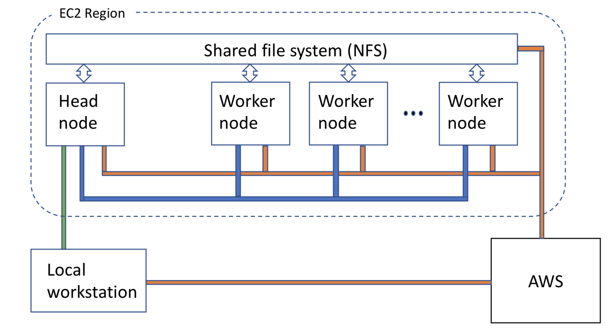

Project-Xbow
============

**Xbow** allows you to create your own custom compute cluster in the cloud. The cluster has a "head' node that you communicate with and can log in to, a number of 'worker' nodes to run your jobs, and a shared file system that links them all together.

Currently **Xbow** focusses on supporting the Biomolecular Simulation community, but is potentially useful in any field.

Currently **Xbow** runs only on Amazon Web Services (AWS), and you must have an AWS account set up before you can use **Xbow**.

Getting and Installing **Xbow**
~~~~~~~~~~~~~~~~~~~~~~~~~~~~~~~~

The recommended method to install **Xbow** is using pip::

    pip install xbow

Configuring **Xbow**
~~~~~~~~~~~~~~~~~~~~~

Before configuring **Xbow**, you must configure your AWS environment. Follow the instructions `here <https://docs.aws.amazon.com/cli/latest/userguide/cli-chap-getting-started.html>`_ to do that.

Once you have reached the point where you have a ``$HOME/.aws`` folder containing a ``config`` and ``credentials`` file you are ready to use **Xbow**!

First configure **Xbow** itself, by running the command::

    xbow-config

This command creates a directory ``$HOME/.xbow`` containing a number of files, including ``settings.yml`` which you can edit at any time in the future to adjust the make-up of your **Xbow** cluster. It also prompts you to type your cluster name.

Your settings.yml file will look like this::

    ### USER SPECIFIC SETTINGS ###
    cluster_name: mycluster                 # your cluster name; type it in the prompt while xbow-config
    scheduler_name: myclusterSchd           # your scheduler name
    worker_pool_name: myclusterWork         # your worker(s) name
    shared_file_system: myclusterFS         # your filesystem name
    creation_token: myclusterFS
    mount_point: /home/ubuntu/shared        # path to where your filesystem is mounted

    ### CLUSTER SPECIFIC SETTINGS ###
    region: eu-west-1                       # AWS region where your instance will be launched 
    price: '0.15'                           # max spot price in US dollars
    image_name: '*xbow-packer-*'            # Amazon Machine Image (AMI) name (newest matching this string)
    scheduler_instance_type: t2.small       # scheduler instance type (hardware)
    worker_instance_type: c5.xlarge         # worker instance type (hardware)
    pool_size: 2                            # how many workers required
    worker_nprocs: 1                        # how many jobs can be run in parallel on each worker

    ### SECURITY SPECIFIC SETTINGS ###
    ec2_security_groups: ['SG-1']
    efs_security_groups: ['SG-2']

The default values in ``settings.yml`` will launch a **Xbow** cluster consisting of a head node and two worker nodes. The
head node will be a ``t2.small`` instance and each worker will be a ``c5.xlarge`` instance. The head node is a conventional
instance but the workers are "spot" instances - see the AWS documentation `here <https://aws.amazon.com/ec2/spot/>`_. All
instances use the same image; the default provides only basic software, you will need to install MD codes, Python packages
etc. at launch time ('provision' the instances). The image has Docker installed, so you may be able to use `Pinda <https://claughton.bitbucket.io/pinda.html>`_ for this.

Creating an Xbow Filesystem
~~~~~~~~~~~~~~~~~~~~~~~~~~~

If this is the first time you have used **Xbow** you will need to create a shared filesystem for use with **Xbow**. This is done by running the command::

    xbow-create_filesystem

This only needs to be performed once and **Xbow** handles all the configuration settings.

Creating a head (scheduler) node
~~~~~~~~~~~~~~~~~~~~~~~~~~~~~~~~

If you only want to boot up a scheduler, you can use the command::

    xbow-launch
    
This boots up only a scheduler, but not any worker nodes.    

Running **Xbow** jobs without logging in to the cluster
~~~~~~~~~~~~~~~~~~~~~~~~~~~~~~~~~~~~~~~~~~~~~~~~~~~~~~~

**Xbow** has been designed to require you to make minimal changes to the way you are used to running jobs on your local machine. Running jobs using **Xbow** can be as simple as the following example::

If your local job runs like this::

    executable -a arg1 -b arg2 -c arg3

Simply change it to::

    xbow-submit executable -a arg1 -b arg2 -c arg3

This will boot a worker node, transfer all your data to the **xbow** cluster, and begin running your job there. 

To check on the status of your job use the command::

    xbow-check

This will tell you if your job is still running or if it is finished. If it has finished it will copy all your data back to your local machine and delete it from the cloud. 

Creating an **Xbow** Cluster
~~~~~~~~~~~~~~~~~~~~~~~~~~~~

To create a new **Xbow** cluster, run the command::

    xbow-create_cluster

This command will create the head node, worker nodes, and shared file system according to the specification in your ``settings.yml`` file.

If you need to install extra software (e.g. an MD code, particular Python packages) you can do this at launch time by specifying a provisioning script::

    xbow-create_cluster -s add_gromacs.sh
    
See the examples for guidance as to the format of provisioning scripts.

Launching Xbow:Portal
~~~~~~~~~~~~~~~~~~~~~

To launch Xbow:Portal, run the command::

    xbow-portal

This will start configuring the Xbow:Portal. Copy the URL from the terminal to your browser, and you can start using the GUI to run Amber and Gromacs simulations on your Xbow cluster. On Xbow:Portal you can also monitor the progress of your jobs, view and download output files, or check your cluster status.

    
Logging in to the head node
~~~~~~~~~~~~~~~~~~~~~~~~~~~

For simple jobs you may never need to log into the **xbow** cluster at all. But if you want to log in to the head node you can using the command::

    xbow-login

From here you can run more complex jobs and workflows using the **Xflow** tool. See `here <https://github.com/ChrisSuess/Project-Xbow/wiki/An-Introduction-to-Xbowflow-Workflows>`_ for details.

Transferring Data to and from your **Xbow** Cluster
~~~~~~~~~~~~~~~~~~~~~~~~~~~~~~~~~~~~~~~~~~

If you choose to use **Xbow** outside the **xbow-sync** command, you take responsibility for transferring ("staging") data
between your local machine and the cluster. Typically, you first create a folder on your local workstation in which you place 
all required input files for your simulation. You then copy the whole folder to the shared filesystem on the **Xbow** cluster,
log in to the cluster and run the job, and when it has finished copy all the results files back to your local machine.

To **Sync** data between your machine and your **Xbow** cluster use the command::

    xbow-sync

Deleting Your **Xbow** Cluster
~~~~~~~~~~~~~~~~~~~~~~~~~~~~~~

Remember that, as a cloud resource, you are paying for your **Xbow** cluster whether you are using it or not, so once your jobs are finished, you should delete it. Deleting the cluster does NOT delete the shared file system though, so at any time you can create a new **Xbow** cluster and your data will still be there (unless it has alreday been copied back by an **xbow-check** command). 

To delete the entire cluster::

    xbow-delete_cluster

To delete the workers and keep the head node alive use the command::

    xbow-delete_workers

Running an Example **Xbow** Job
~~~~~~~~~~~~~~~~~~~~~~~~~~~~~~~

1. Obtain the example files
---------------------------
Download the examples tarball::

    curl https://raw.githubusercontent.com/ChrisSuess/Project-Xbow/devel/xbowflow/examples.tgz -o examples.tgz

Then uncompress this::

    tar -zxvf examples.tgz

This should create a new folder called *examples*. For this example we are going to use the files in the folder
*SimpleJobs/Gromacs* which will run a short MD simulation of BPTI::

    cd examples/SimpleJobs/Gromacs
    
2. Launch your **Xbow** cluster
-------------------------------

If you have not already done so, create your **Xbow** environment: run ``xbow-configure`` and ``xbow-create_filesystem`` 
(see above).

Next launch your **Xbow** cluster.::

    xbow-create_cluster

(Note: this step may take five minutes or so to complete.)

3. Running your job on **Xbow**
~~~~~~~~~~~~~~~~~~~~~~~~~~~~~~~

Running a job on a xbow cluster is easy. Simply add the command **xbow-submit** to the start of your usual job command.::

    xbow-submit gmx mdrun -deffnm bpti-md

To check on the status of the job use the command::

    xbow-check

When finished **xbow-check** will bring all your data back to your local machine and delete it from the cloud.

4. Deleting your **Xbow** cluster
~~~~~~~~~~~~~~~~~~~~~~~~~~~~~~~~~

Unless you want to try one of the other examples, delete the cluster::

    xbow-delete_cluster

The filesystem you created is not deleted so all your data remains safe. This allows you to resume working exactly where you left off however you will still be charged for data storage in the cloud.

If you wish to delete your filesystem use the command::

    xbow-delete_filesystem

This further prompts you to help avoid any nasty data deletion accidents!
